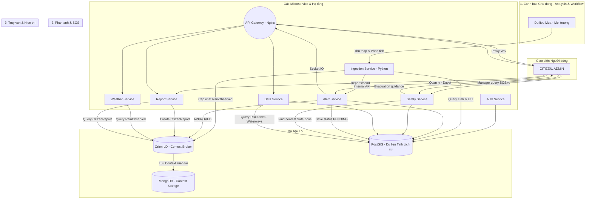

<!--
  Copyright 2025 HaUI.DNK
  Licensed under the Apache License, Version 2.0
  http://www.apache.org/licenses/LICENSE-2.0
-->

# VIET-RESILIENCE-HUB HỆ THỐNG NỀN TẢNG DỮ LIỆU MỞ GIÚP CẢNH BÁO SỚM VÀ PHẢN ỨNG KHẨN CẤP THIÊN TAI (Bài dự thi OLP PMNM 2025)

**Đội:** HaUI-DNK

**Trường:** Trường Công Nghệ Thông Tin và Truyền Thông (SICT) - Đại Học Công Nghiệp Hà Nội

<!-- [](https://github.com/PhamQuyNam/OLP_2025_PMMNM_HaUI_DNK.git) -->
[](./LICENSE)

Bài dự thi Phát triển ứng dụng thành phố thông minh dựa trên nền tảng dữ liệu mở.

## 💡 Ý tưởng Cốt lõi: 

Hệ thống của chúng tôi là một giải pháp tiên phong nhằm chuyển đổi mô hình quản lý thiên tai tại Việt Nam từ phản ứng thụ động sang **dự báo chủ động** và **phản ứng phối hợp hai chiều**. Ý tưởng cốt lõi là thiết lập một nền tảng **Dữ liệu Mở (Open Context Data Platform)** sử dụng chuẩn **NGSI-LD** để quản lý trạng thái **thời gian thực** của các Thực thể liên quan đến nguy cơ thiên tai. Hệ thống không chỉ tích hợp các **tiêu chí dự đoán** khoa học (như Độ dốc , Lượng mưa tích lũy , Độ ẩm đất), mà còn tạo ra **kênh tương tác hai chiều** giữa các nhà quản lý với người dân. Nhà quản lý có được **Bản đồ Tình huống Chung** để ra quyết định , trong khi người dân có thể gửi các **Báo cáo sự cố** hoặc **tín hiệu Cầu cứu (SOS)** tức thời , tạo ra nguồn dữ liệu **NGSI-LD:CitizenReport** để hỗ trợ công tác cứu hộ. Toàn bộ hệ thống được xây dựng bằng công nghệ nguồn mở, đảm bảo tính khả chuyển và khả năng tái sử dụng cao.

## 🏗️ Kiến trúc Hệ thống

Đây là sơ đồ mô tả luồng dữ liệu chính, từ người dùng đến lớp dữ liệu lõi và ngược lại.


## 🛠️ Công nghệ & Phụ thuộc (Tech Stack)

Nền tảng này sử dụng và tích hợp các PMMN sau:

- **Nền tảng Dữ liệu Đô thị Mở:**	FIWARE Orion-LD Context Broker  
- **Mô hình hóa Dữ liệu:** Sử dụng tiêu chuẩn SOSA/SSN (W3C)
- **Lưu Trữ Dữ liệu (GIS/Relational):**  PostgreSQL (Kèm theo tiện ích mở rộng PostGIS)
- **Lưu Trữ Lịch sử (Historian):** FIWARE QuantumLeap (với Mongodb )  
- **Lưu Trữ Media/Object:** MinIO
- **Backend API Gateway:** Node.js (Express)
- **Ingestion Service:** Python (Scikit-learn, Pandas)
- **Frontend/Giao diện:** React.js  
- **Bản Đồ Số:** Leaflet.js  
- **Đóng gói/Triển khai:** Docker và Docker Compose

## 🚀 Hướng dẫn Cài đặt

Hệ thống yêu cầu đã cài đặt Docker và Docker Compose.

**Clone kho mã nguồn:**
```bash
git clone https://github.com/PhamQuyNam/OLP_2025_PMMNM_HaUI_DNK.git
```

**Cấu hình môi trường**

Trước khi chạy dự án, bạn cần thiết lập các file môi trường (`.env`) cho từng service:

- `alert-service`
- `auth-service`
- `data-service`
- `safety-service`
- File `.env` trong thư mục gốc dự án

**Hướng dẫn**

1. Copy file mẫu `.env.example` thành `.env`:

```bash
cp .env.example .env
```
2. Mở file `.env` vừa tạo và chỉnh sửa các thông số cấu hình theo nhu cầu của bạn.  
   Các thông số chính cần lưu ý bao gồm:

**Cấu hình Database (PostGIS)**  
  - `POSTGRES_USER` – Tên người dùng cơ sở dữ liệu  
  - `POSTGRES_PASSWORD` – Mật khẩu cơ sở dữ liệu  
  - `POSTGRES_DB` – Tên cơ sở dữ liệu  
  - `POSTGRES_HOST` – Địa chỉ host của database

**Cấu hình API bên ngoài**  
  - `OPENWEATHER_API_KEY` – API key từ OpenWeather  
  - `ORION_HOST` – URL của service Orion Context Broker

**Cấu hình bảo mật**  
  - `JWT_SECRET` – Khóa bí mật JWT dùng cho xác thực  
  - `EMAIL_USER` – Email dùng để gửi thông báo  
  - `EMAIL_PASS` – Mật khẩu ứng dụng (App Password) cho email

**Chạy ứng dụng**  
(Mở terminal trong thư mục gốc và chạy lệnh)
```bash
docker-compose up -d --build  
```

## 🌐 Xem Giao diện Web (Ví dụ)

- **Dashboard Nhà Quản lý:** http://localhost:3001/manager   
- **Ứng dụng Người Dân:** http://localhost:3001/citizen   
- **API Backend (Node.js):** http://localhost:8000/api/...
- **API Cảnh báo/Báo cáo:** http://localhost:3004/api/...
- **Orion-LD Context Broker:** http://localhost:1026/ngsi-ld/v1/entities  

**Dừng hệ thống:**
```bash
docker-compose stop
```
**Dọn dẹp hoàn toàn (Xóa container, network, và volumes):**
```bash
docker-compose down -v
```

<!-- ## 📚 Tài liệu Chi tiết

Tài liệu này chỉ là tổng quan. Toàn bộ mô tả chi tiết về Backend, Infrastructure, API, và hướng dẫn sử dụng đều có tại trang Docusaurus của dự án.

➡️ **Xem tài liệu đầy đủ tại đây:**  -->


## 🤝 Đóng góp cho Dự án

* **Báo lỗi ⚠️:** [Tạo một Bug Report](https://github.com/PhamQuyNam/OLP_2025_PMMNM_HaUI_DNK/issues/new?assignees=&labels=bug&template=bug_report.md&title=[BUG])
* **Yêu cầu tính năng 👩‍💻:** [Đề xuất một tính năng mới](https://github.com/PhamQuyNam/OLP_2025_PMMNM_HaUI_DNK/issues/new?assignees=&labels=enhancement&template=feature_request.md&title=[FEAT])

Nếu bạn muốn đóng góp cho dự án, hãy đọc `CONTRIBUTING.md` để biết thêm chi tiết.
Mọi đóng góp của các bạn đều được trân trọng, đừng ngần ngại gửi pull request cho dự án.

---

## 📞 Liên hệ

* **Phạm Quý Nam:** phamquynam2004@gmail.com
* **Trịnh Gia Luật:** luattrinh2k4@gmail.com
* **Ngô Văn Tấn:** ngovantannvt04@gmail.com

---
## ⚖️ Giấy phép

Dự án này được cấp phép theo Giấy phép **Apache 2.0**. Xem chi tiết tại file [LICENSE](./LICENSE).