<!--
  Copyright 2025 HaUI.DNK
  Licensed under the Apache License, Version 2.0
  http://www.apache.org/licenses/LICENSE-2.0
-->

# VIET-RESILIENCE-HUB HỆ THỐNG NỀN TĂNG DỮ LIỆU MỞ GIÚP CẢNH BÁO SỚM VÀ PHẢN ỨNG KHẨN CẤP THIÊN TAI (Bài dự thi OLP PMNM 2025)

**Đội:** HaUI-DNK

**Trường:** Trường Công Nghệ Thông Tin và Truyền Thông (SICT) - Đại Học Công Nghiệp Hà Nội

<!-- [](https://github.com/PhamQuyNam/OLP_2025_PMMNM_HaUI_DNK.git) -->
[](./LICENSE)

Bài dự thi Phát triển ứng dụng thành phố thông minh dựa trên nền tảng dữ liệu mở.

## 💡 Ý tưởng Cốt lõi: 

Hệ thống của chúng tôi là một giải pháp tiên phong nhằm chuyển đổi mô hình quản lý thiên tai tại Việt Nam từ phản ứng thụ động sang **dự báo chủ động** và **phản ứng phối hợp hai chiều**. Ý tưởng cốt lõi là thiết lập một nền tảng **Dữ liệu Mở (Open Context Data Platform)** sử dụng chuẩn **NGSI-LD** để quản lý trạng thái **thời gian thực** của các Thực thể liên quan đến nguy cơ thiên tai. Hệ thống không chỉ tích hợp các **tiêu chí dự đoán** khoa học (như Độ dốc , Lượng mưa tích lũy , Độ ẩm đất), mà còn tạo ra **kênh tương tác hai chiều** giữa các nhà quản lý với người dân. Nhà quản lý có được **Bản đồ Tình huống Chung** để ra quyết định , trong khi người dân có thể gửi các **Báo cáo sự cố** hoặc **tín hiệu Cầu cứu (SOS)** tức thời , tạo ra nguồn dữ liệu **NGSI-LD:CitizenReport** để hỗ trợ công tác cứu hộ. Toàn bộ hệ thống được xây dựng bằng công nghệ nguồn mở, đảm bảo tính khả chuyển và khả năng tái sử dụng cao.

## 🏗️ Kiến trúc Hệ thống

Đây là sơ đồ mô tả luồng dữ liệu chính, từ người dùng đến lớp dữ liệu lõi và ngược lại.

```mermaid
flowchart LR
    %% ===== 0. AUTH & INFRA =====
    subgraph S0["0. Hạ tầng & Xác thực"]
        A[Người dùng] --> AUTH[Xác thực / Phân quyền]
        AUTH --> DBUser[(PostgreSQL + PostGIS)]
    end

    %% ===== 1. INGESTION =====
    subgraph S1["1. Thu thập & Chuẩn hoá Dữ liệu"]
        direction LR
        OpenAPI["Dữ liệu Mở (Thời tiết)"]
        StaticData["Dữ liệu Tĩnh (Địa hình, Đất, Ngưỡng)"]
        Citizen["Người dân gửi phản ánh"]

        OpenAPI --> INGEST["Ingestion Service"]
        StaticData --> INGEST
        Citizen --> API["API Gateway"]

        INGEST -->|"Chuẩn hóa NGSI-LD"| Orion
    end

    %% ===== 2. CONTEXT CORE =====
    subgraph S2["2. Nền tảng Dữ liệu Ngữ cảnh (FIWARE)"]
        direction LR
        Orion[Orion-LD Context Broker]
        Mongo[(MongoDB - Context Storage)]

        Orion -->|"Lưu Context hiện tại"| Mongo
        Orion -->|"Publish sự kiện"| Logic["Dịch vụ Logic / Rule Engine"]

        subgraph P["Lưu lịch sử"]
            Orion --> QL[QuantumLeap]
            QL --> TS[(TimescaleDB)]
        end
    end

    %% ===== 3. BUSINESS & ML =====
    subgraph S3["3. Phân tích & Dự đoán"]
        Logic -->|"Query dữ liệu tĩnh"| DBUser
        Logic -->|"Chạy mô hình ML"| Model["Model dự báo Sạt lở / Lũ quét"]
        Model -->|"Cập nhật cảnh báo"| Orion
        API -->|"Tạo/Cập nhật CitizenReport"| Orion
    end

    %% ===== 4. APPLICATION =====
    subgraph S4["4. Ứng dụng"]
        Admin["Web Dashboard"]

        Admin -->|"Query trạng thái"| Orion
        Admin -->|"Truy vấn lịch sử"| TS
        Admin -->|"Quản lý dữ liệu tĩnh"| DBUser
    end

```


## 🛠️ Công nghệ & Phụ thuộc (Tech Stack)

Nền tảng này sử dụng và tích hợp các PMMN sau:

- **Nền tảng Dữ liệu Đô thị Mở:**	FIWARE Orion-LD Context Broker  
- **Mô hình hóa Dữ liệu:** Sử dụng tiêu chuẩn SOSA/SSN (W3C)
- **Lưu Trữ Dữ liệu (GIS/Relational):**  PostgreSQL (Kèm theo tiện ích mở rộng PostGIS)
- **Lưu Trữ Lịch sử (Historian):** FIWARE QuantumLeap (với Mongodb )  
- **Lưu Trữ Media/Object:** MinIO
- **Backend API Gateway:** Node.js (Express)
- **Ingestion Service:** Python (Scikit-learn, Pandas)
- **Frontend/Giao diện:** React.js  
- **Bản Đồ Số:** Leaflet.js  
- **Đóng gói/Triển khai:** Docker và Docker Compose

## 🚀 Hướng dẫn Cài đặt

Hệ thống yêu cầu đã cài đặt Docker và Docker Compose.

**Clone kho mã nguồn:**
```bash
git clone https://github.com/PhamQuyNam/OLP_2025_PMMNM_HaUI_DNK.git
```

**Chạy ứng dụng**  
(Mở terminal trong thư mục gốc và chạy lệnh)
```bash
docker-compose up -d --build  
```

## 🌐 Xem Giao diện Web (Ví dụ)

- **Dashboard Nhà Quản lý:** http://localhost:3001/manager   
- **Ứng dụng Người Dân:** http://localhost:3001/citizen   
- **API Backend (Node.js):** http://localhost:8000/api/...
- **API Cảnh báo/Báo cáo:** http://localhost:3004/api/...
- **Orion-LD Context Broker:** http://localhost:1026/ngsi-ld/v1/entities  

**Dừng hệ thống:**
```bash
docker-compose stop
```
**Dọn dẹp hoàn toàn (Xóa container, network, và volumes):**
```bash
docker-compose down -v
```

<!-- ## 📚 Tài liệu Chi tiết

Tài liệu này chỉ là tổng quan. Toàn bộ mô tả chi tiết về Backend, Infrastructure, API, và hướng dẫn sử dụng đều có tại trang Docusaurus của dự án.

➡️ **Xem tài liệu đầy đủ tại đây:**  -->


## 🤝 Đóng góp cho Dự án

* **Báo lỗi ⚠️:** [Tạo một Bug Report](https://github.com/PhamQuyNam/OLP_2025_PMMNM_HaUI_DNK/issues/new?assignees=&labels=bug&template=bug_report.md&title=[BUG])
* **Yêu cầu tính năng 👩‍💻:** [Đề xuất một tính năng mới](https://github.com/PhamQuyNam/OLP_2025_PMMNM_HaUI_DNK/issues/new?assignees=&labels=enhancement&template=feature_request.md&title=[FEAT])

Nếu bạn muốn đóng góp cho dự án, hãy đọc `CONTRIBUTING.md` để biết thêm chi tiết.
Mọi đóng góp của các bạn đều được trân trọng, đừng ngần ngại gửi pull request cho dự án.

---

## 📞 Liên hệ

* **Phạm Quý Nam:** phamquynam2004@gmail.com
* **Trịnh Gia Luật:** luattrinh2k4@gmail.com
* **Ngô Văn Tấn:** ngovantannvt04@gmail.com

---
## ⚖️ Giấy phép

Dự án này được cấp phép theo Giấy phép **Apache 2.0**. Xem chi tiết tại file [LICENSE](./LICENSE).