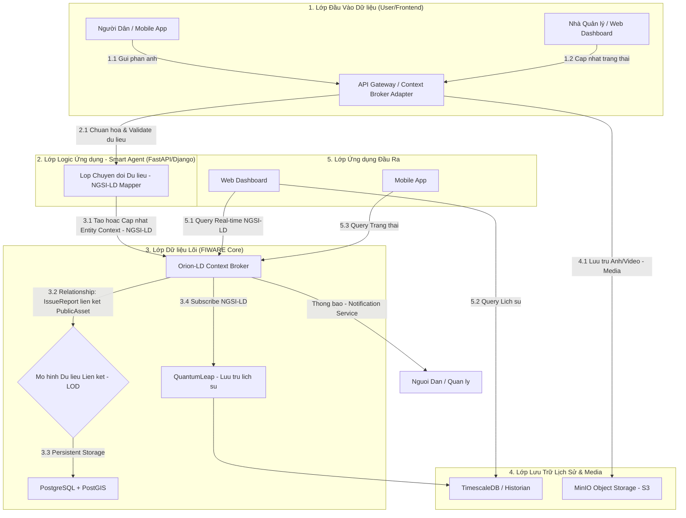

# XÂY DỰNG ỨNG DỤNG NGUỒN MỞ QUẢN LÝ TÀI SẢN CÔNG CỘNG TRONG THÀNH PHỐ TỪ DỮ LIỆU CÔNG KHAI (Bài dự thi OLP PMNM 2025)

**Đội:** Haui-DNK

**Trường:** Trường Công Nghệ Thông Tin và Truyền Thông (SICT) - Đại Học Công Nghiệp Hà Nội

[](https://github.com/PhamQuyNam/OLP_2025_PMMNM_HaUI_DNK.git)
[](./LICENSE)

Bài dự thi Xây dựng ứng dụng thành phố thông minh dựa trên nền tảng dữ liệu mở.

## 💡 Ý tưởng Cốt lõi: Nền Tảng "SỨC MẠNH CỘNG ĐỒNG" Quản Lý Tài Sản Công Cộng

Chúng tôi không chỉ xây dựng một ứng dụng; chúng tôi kiến tạo **Hệ thống Quản lý Tài sản Công cộng Thời gian Thực** dựa trên triết lý **Dữ liệu Mở** và **Mô hình Liên kết (LOD)**.
Sứ mệnh cốt lõi của giải pháp là chuyển đổi vai trò của **Người Dân** từ người thụ động thành **"Cảm Biến Sống" (Live Sensor)** cho Thành phố.

Giải pháp của chúng tôi đóng vai trò là **'Cầu Nối Khẩn Cấp'** kỹ thuật số, sử dụng sức mạnh của nguồn mở **(Apache License)** và tiêu chuẩn IoT mở **(NGSI-LD/FIWARE)** để tạo ra một cơ chế giám sát tài sản công cộng minh bạch và tức thời. Thay vì chờ đợi, người dân chỉ cần **một cú chạm** để báo cáo sự cố (từ đèn đường hỏng đến nắp cống mất), đồng thời gắn nhãn vị trí **(Geo-Tagging)** và tình trạng. Ngay lập tức, dữ liệu này trở thành **Context Entity** trong nền tảng dữ liệu đô thị mở, kích hoạt **quy trình khắc phục** ưu tiên cho nhà quản lý.

## 🏗️ Kiến trúc Hệ thống

Đây là sơ đồ mô tả luồng dữ liệu chính, từ người dùng đến lớp dữ liệu lõi và ngược lại.


## 🛠️ Công nghệ & Phụ thuộc (Tech Stack)

Nền tảng này sử dụng và tích hợp các PMMN sau:

- **Nền tảng Dữ liệu Đô thị Mở:**	FIWARE Orion-LD Context Broker  
- **Lưu Trữ Dữ liệu (GIS/Relational):**  PostgreSQL (Kèm theo tiện ích mở rộng PostGIS)
- **Lưu Trữ Lịch sử (Historian):** FIWARE QuantumLeap (với Mongodb )  
- **Backend/Smart Agent:** Python (FastAPI )  
- **Frontend/Giao diện:** React.js  
- **Bản Đồ Số:** Leaflet.js  
- **Lưu Trữ Media/Object:** MinIO
- **Đóng gói/Triển khai:** Docker và Docker Compose

## 🚀 Hướng dẫn Cài đặt

Hệ thống yêu cầu đã cài đặt Docker và Docker Compose.

**Clone kho mã nguồn:**
```bash
git clone https://github.com/PhamQuyNam/OLP_2025_PMMNM_HaUI_DNK.git
```

**Chạy ứng dụng**  
(Mở terminal trong thư mục gốc và chạy lệnh)
```bash
docker-compose up --build -d 
```

## 🌐 Xem Giao diện Web (Ví dụ)

- **Ứng dụng Web (Frontend):** http://localhost:3000   
- **API Backend (Smart Agent):** http://localhost:8000  
- **Orion-LD Context Broker:** http://localhost:1026/version  

**Dừng hệ thống:**
```bash
docker-compose stop
```
**Dọn dẹp hoàn toàn (Xóa container, network, và volumes):**
```bash
docker-compose down -v
```

<!-- ## 📚 Tài liệu Chi tiết

Tài liệu này chỉ là tổng quan. Toàn bộ mô tả chi tiết về Backend, Infrastructure, API, và hướng dẫn sử dụng đều có tại trang Docusaurus của dự án.

➡️ **Xem tài liệu đầy đủ tại đây:**  -->


## 🤝 Đóng góp cho Dự án

* **Báo lỗi ⚠️:** [Tạo một Bug Report](https://github.com/PhamQuyNam/OLP_2025_PMMNM_HaUI_DNK/issues/new?assignees=&labels=bug&template=bug_report.md&title=[BUG])
* **Yêu cầu tính năng 👩‍💻:** [Đề xuất một tính năng mới](https://github.com/PhamQuyNam/OLP_2025_PMMNM_HaUI_DNK/issues/new?assignees=&labels=enhancement&template=feature_request.md&title=[FEAT])

Nếu bạn muốn đóng góp cho dự án, hãy đọc `CONTRIBUTING.md` để biết thêm chi tiết.
Mọi đóng góp của các bạn đều được trân trọng, đừng ngần ngại gửi pull request cho dự án.

---

## 📞 Liên hệ

* **Phạm Qúy Nam:** phamquynam2004@gmail.com
* **Trịnh Gia Luật:** luattrinh2k4@gmail.com
* **Ngô Văn Tấn:** ngovantannvt04@gmail.com

---
## ⚖️ Giấy phép

Dự án này được cấp phép theo Giấy phép **Apache 2.0**. Xem chi tiết tại file [LICENSE](./LICENSE).